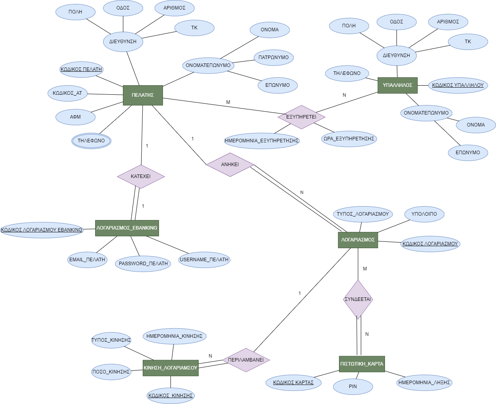
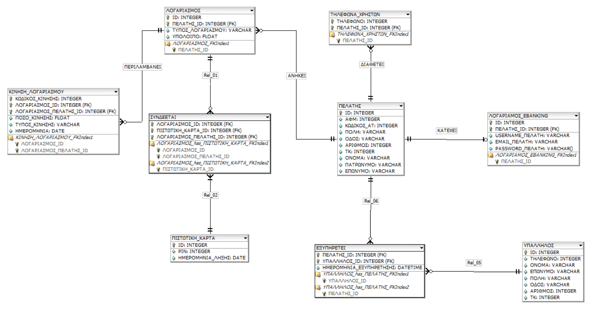

# Database Design Project

This repository contains the design approach for a database system based on specific requirements. The report.pdf contains explanations for my choices. 

## Contents:

1. [ER Diagram](er-diagram.png)
2. [Relational Diagram](relational_diagram.png)
3. [SQL Code](bank.sql)

## ER Diagram



The ER diagram provides a visual representation of the entities and their relationships within the database system.

## Relational Diagram



The Relational diagram illustrates the structure of the tables and their relationships, derived from the ER diagram.

## SQL Code

```sql

-- SQL code automatically generated using DBDesigner Fork

-- Example SQL code:

CREATE TABLE ΠΕΛΑΤΗΣ (
  ID INTEGER  NOT NULL  ,
  ΑΦΜ INTEGER    ,
  ΚΩΔΙΚΟΣ_ΑΤ INTEGER    ,
  ΠΟΛΗ VARCHAR    ,
  ΟΔΟΣ VARCHAR    ,
  ΑΡΙΘΜΟΣ INTEGER    ,
  ΤΚ INTEGER    ,
  ΟΝΟΜΑ VARCHAR    ,
  ΠΑΤΡΩΝΥΜΟ VARCHAR    ,
  ΕΠΩΝΥΜΟ VARCHAR      ,
PRIMARY KEY(ID));


CREATE TABLE ΠΙΣΤΩΤΙΚΗ_ΚΑΡΤΑ (
  ID INTEGER  NOT NULL  ,
  PIN INTEGER    ,
  ΗΜΕΡΟΜΗΝΙΑ_ΛΗΞΗΣ DATE      ,
PRIMARY KEY(ID));


CREATE TABLE ΥΠΑΛΛΗΛΟΣ (
  ID INTEGER  NOT NULL  ,
  ΤΗΛΕΦΩΝΟ INTEGER    ,
  ΟΝΟΜΑ VARCHAR    ,
  ΕΠΩΝΥΜΟ VARCHAR    ,
  ΠΟΛΗ VARCHAR    ,
  ΟΔΟΣ VARCHAR    ,
  ΑΡΙΘΜΟΣ INTEGER    ,
  ΤΚ INTEGER      ,
PRIMARY KEY(ID));


CREATE TABLE ΤΗΛΕΦΩΝΑ_ΧΡΗΣΤΩΝ (
  ΤΗΛΕΦΩΝΟ INTEGER  NOT NULL  ,
  ΠΕΛΑΤΗΣ_ID INTEGER  NOT NULL    ,
PRIMARY KEY(ΤΗΛΕΦΩΝΟ, ΠΕΛΑΤΗΣ_ID)  ,
  FOREIGN KEY(ΠΕΛΑΤΗΣ_ID)
    REFERENCES ΠΕΛΑΤΗΣ(ID)
      ON DELETE NO ACTION
      ON UPDATE NO ACTION);


CREATE INDEX ΤΗΛΕΦΩΝΑ_ΧΡΗΣΤΩΝ_FKIndex1 ON ΤΗΛΕΦΩΝΑ_ΧΡΗΣΤΩΝ (ΠΕΛΑΤΗΣ_ID);


CREATE TABLE ΛΟΓΑΡΙΑΣΜΟΣ (
  ID INTEGER  NOT NULL  ,
  ΠΕΛΑΤΗΣ_ID INTEGER  NOT NULL  ,
  ΤΥΠΟΣ_ΛΟΓΑΡΙΑΣΜΟΥ VARCHAR    ,
  ΥΠΟΛΟΙΠΟ FLOAT      ,
PRIMARY KEY(ID, ΠΕΛΑΤΗΣ_ID)  ,
  FOREIGN KEY(ΠΕΛΑΤΗΣ_ID)
    REFERENCES ΠΕΛΑΤΗΣ(ID)
      ON DELETE NO ACTION
      ON UPDATE NO ACTION);


CREATE INDEX ΛΟΓΑΡΙΑΣΜΟΣ_FKIndex1 ON ΛΟΓΑΡΙΑΣΜΟΣ (ΠΕΛΑΤΗΣ_ID);


CREATE TABLE ΛΟΓΑΡΙΑΜΟΣ_EBANKING (
  ID INTEGER  NOT NULL  ,
  ΠΕΛΑΤΗΣ_ID INTEGER  NOT NULL  ,
  USERNAME_ΠΕΛΑΤΗ VARCHAR    ,
  EMAIL_ΠΕΛΑΤΗ VARCHAR    ,
  PASSWORD_ΠΕΛΑΤΗ VARCHAR      ,
PRIMARY KEY(ID, ΠΕΛΑΤΗΣ_ID)  ,
  FOREIGN KEY(ΠΕΛΑΤΗΣ_ID)
    REFERENCES ΠΕΛΑΤΗΣ(ID)
      ON DELETE NO ACTION
      ON UPDATE NO ACTION);


CREATE INDEX ΛΟΓΑΡΙΑΜΟΣ_EBANKING_FKIndex1 ON ΛΟΓΑΡΙΑΜΟΣ_EBANKING (ΠΕΛΑΤΗΣ_ID);


CREATE TABLE ΕΞΥΠΗΡΕΤΕΙ (
  ΠΕΛΑΤΗΣ_ID INTEGER  NOT NULL  ,
  ΥΠΑΛΛΗΛΟΣ_ID INTEGER  NOT NULL  ,
  ΗΜΕΡΟΜΗΝΙΑ_ΕΞΥΠΗΡΕΤΗΣΗΣ DATETIME      ,
PRIMARY KEY(ΠΕΛΑΤΗΣ_ID, ΥΠΑΛΛΗΛΟΣ_ID)    ,
  FOREIGN KEY(ΥΠΑΛΛΗΛΟΣ_ID)
    REFERENCES ΥΠΑΛΛΗΛΟΣ(ID)
      ON DELETE NO ACTION
      ON UPDATE NO ACTION,
  FOREIGN KEY(ΠΕΛΑΤΗΣ_ID)
    REFERENCES ΠΕΛΑΤΗΣ(ID)
      ON DELETE NO ACTION
      ON UPDATE NO ACTION);


CREATE INDEX ΥΠΑΛΛΗΛΟΣ_has_ΠΕΛΑΤΗΣ_FKIndex1 ON ΕΞΥΠΗΡΕΤΕΙ (ΥΠΑΛΛΗΛΟΣ_ID);
CREATE INDEX ΥΠΑΛΛΗΛΟΣ_has_ΠΕΛΑΤΗΣ_FKIndex2 ON ΕΞΥΠΗΡΕΤΕΙ (ΠΕΛΑΤΗΣ_ID);


CREATE TABLE ΣΥΝΔΕΕΤΑΙ (
  ΛΟΓΑΡΙΑΣΜΟΣ_ID INTEGER  NOT NULL  ,
  ΠΙΣΤΩΤΙΚΗ_ΚΑΡΤΑ_ID INTEGER  NOT NULL  ,
  ΛΟΓΑΡΙΑΣΜΟΣ_ΠΕΛΑΤΗΣ_ID INTEGER  NOT NULL    ,
PRIMARY KEY(ΛΟΓΑΡΙΑΣΜΟΣ_ID, ΠΙΣΤΩΤΙΚΗ_ΚΑΡΤΑ_ID, ΛΟΓΑΡΙΑΣΜΟΣ_ΠΕΛΑΤΗΣ_ID)    ,
  FOREIGN KEY(ΛΟΓΑΡΙΑΣΜΟΣ_ID, ΛΟΓΑΡΙΑΣΜΟΣ_ΠΕΛΑΤΗΣ_ID)
    REFERENCES ΛΟΓΑΡΙΑΣΜΟΣ(ID, ΠΕΛΑΤΗΣ_ID)
      ON DELETE NO ACTION
      ON UPDATE NO ACTION,
  FOREIGN KEY(ΠΙΣΤΩΤΙΚΗ_ΚΑΡΤΑ_ID)
    REFERENCES ΠΙΣΤΩΤΙΚΗ_ΚΑΡΤΑ(ID)
      ON DELETE NO ACTION
      ON UPDATE NO ACTION);


CREATE INDEX ΛΟΓΑΡΙΑΣΜΟΣ_has_ΠΙΣΤΩΤΙΚΗ_ΚΑΡΤΑ_FKIndex1 ON ΣΥΝΔΕΕΤΑΙ (ΛΟΓΑΡΙΑΣΜΟΣ_ID, ΛΟΓΑΡΙΑΣΜΟΣ_ΠΕΛΑΤΗΣ_ID);
CREATE INDEX ΛΟΓΑΡΙΑΣΜΟΣ_has_ΠΙΣΤΩΤΙΚΗ_ΚΑΡΤΑ_FKIndex2 ON ΣΥΝΔΕΕΤΑΙ (ΠΙΣΤΩΤΙΚΗ_ΚΑΡΤΑ_ID);


CREATE TABLE ΚΙΝΗΣΗ_ΛΟΓΑΡΙΑΣΜΟΥ (
  ΚΩΔΙΚΟΣ_ΚΙΝΗΣΗΣ INTEGER  NOT NULL  ,
  ΛΟΓΑΡΙΑΣΜΟΣ_ID INTEGER  NOT NULL  ,
  ΛΟΓΑΡΙΑΣΜΟΣ_ΠΕΛΑΤΗΣ_ID INTEGER  NOT NULL  ,
  ΠΟΣΟ_ΚΙΝΗΣΗΣ FLOAT    ,
  ΤΥΠΟΣ_ΚΙΝΗΣΗΣ VARCHAR    ,
  ΗΜΕΡΟΜΗΝΙΑ_ΚΙΝΗΣΗΣ DATE  NOT NULL    ,
PRIMARY KEY(ΚΩΔΙΚΟΣ_ΚΙΝΗΣΗΣ, ΛΟΓΑΡΙΑΣΜΟΣ_ID, ΛΟΓΑΡΙΑΣΜΟΣ_ΠΕΛΑΤΗΣ_ID)  ,
  FOREIGN KEY(ΛΟΓΑΡΙΑΣΜΟΣ_ID, ΛΟΓΑΡΙΑΣΜΟΣ_ΠΕΛΑΤΗΣ_ID)
    REFERENCES ΛΟΓΑΡΙΑΣΜΟΣ(ID, ΠΕΛΑΤΗΣ_ID)
      ON DELETE NO ACTION
      ON UPDATE NO ACTION);


CREATE INDEX ΚΙΝΗΣΗ_ΛΟΓΑΡΙΑΣΜΟΥ_FKIndex1 ON ΚΙΝΗΣΗ_ΛΟΓΑΡΙΑΣΜΟΥ (ΛΟΓΑΡΙΑΣΜΟΣ_ID, ΛΟΓΑΡΙΑΣΜΟΣ_ΠΕΛΑΤΗΣ_ID);

